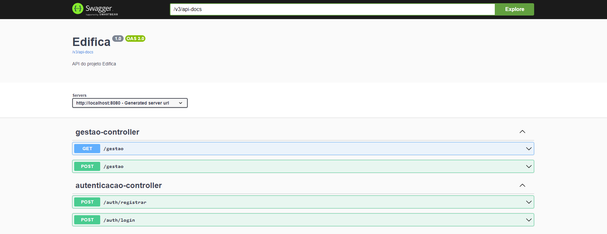

# API Edifica

## Descrição

Esse é repositório é da API utilizada no Projeto Edifica, onde será por ela que faremos com que a interface no Flutter se comunique com o banco de dados, estando presente na segunda camada de nossa arquitetura (aplicação). Na API, estamos desenvolvendo diversas funcionalidades que estão presentes em nossos requisitos funcionais.

### Tecnologias Utilizadas

- **Linguagem de Programação:** O API esta sendo desenvolvida em **Java**, aproveitando as vantagens da linguagem para construir uma API robusta e de alto desempenho.

- **Framework:** Utilizamos o **Spring Boot** como framework principal para o desenvolvimento da API. O Spring Boot oferece uma estrutura sólida e uma vasta gama de ferramentas para facilitar a construção e manutenção da aplicação.

- **Banco de Dados:** A API utiliza o **PostgreSQL** como banco de dados para armazenar as informações sobre os materiais, projetos e demais dados relacionados.

## Documentação

